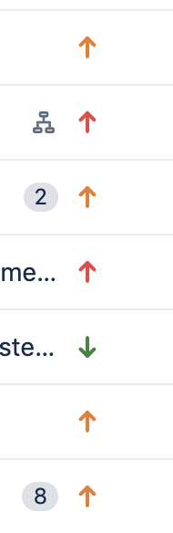
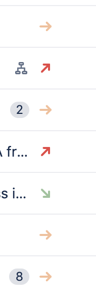

# `jira-sane-priority`
Chrome extension that makes Jira's priority arrows more easily discernable from one another.

## Example

  
Jira's standard arrows for priority level are hard to tell apart because they are close in color and don't have any other    characteristics, such as arrow direction. 
<em>Old: difficult to distinguish from one another</em>

This extension fixes the issue by applying appropriate rotations and de-emphasizing medium-to-low-priority issues. 
<em>New: easier to scan and identify high-priority tickets</em>

## Installation instructions

1. Clone this repository anywhere on your machine.
2. Open the [Extension Management](chrome://extensions) page by navigating to `chrome://extensions`. The Extension Management page can also be opened by clicking on the Chrome menu, hovering over More Tools then selecting Extensions.
3. Enable Developer Mode by clicking the toggle switch next to Developer mode.
4. Click the LOAD UNPACKED button and select the extension directory that you cloned.
